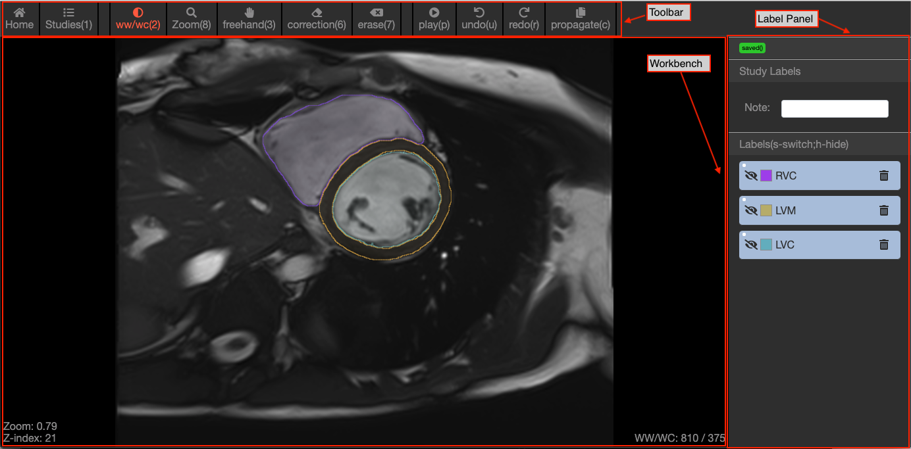
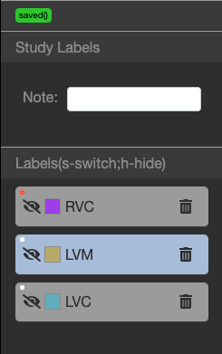
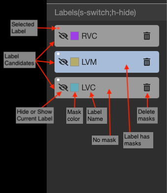

.. Lines

=========================================================
Workbench Page Manual Book(v0.1)
=========================================================

Basic Sections:
^^^^^^^^^^^^^^^^^^^^^^^^^
1. Toolbars:
    Provide multiple functions during annotation process. You can use the letter/number in the bracket as the hotkeys.

2. Label Panel:
    Provide multi-level annotation labels, and status/autosave function.

3. Workbench:
    Display the DICOM images, basic information and could annotate ROIs on the DICOM images.

Toolbars:
^^^^^^^^^^^^^^^^

The function icon will turn red when activated. You can click the letter/number in the bracket as the hotkeys.

1.1 Home: back to list and management page.

1.2 Studies: list all studies in current instance.

1.3 WW/WC: activate change the Window Width/Window Level.

1.4 Zoom: activate zoom the DICOM image.

1.5 Freehand: activate freehand contour annotation tool.

1.6 Correction: activate correction tool. If the contour start from the outside of the existing contour, this tool will act like delete tool. If the countour start from the inside of the existing contour, this tool will act like freehand tool.

1.7 Erase: Delete the label in the selected area.

1.8 Play: Will play all images in current series. Click again to stop.

1.9 Undo & Redo: Will undo or redo the operation before.

``Other hotkeys:``

- Space: switch between Freehand and Correction tool.
- Left and Right Arrow: Navigate difference slices in current series.
- Up and Down arrow: Navigate the previous and the next series.

Navigate Studies:
^^^^^^^^^^^^^^^^^^^^^^^

Click Studies to show all studies list. Hover on one study item, the list will show all the series extracted in current study.
Each series display description in DICOM tag, and DICOM files number belongs to this series.

.. image:: ./imgs/nav.png

Label Panel:
^^^^^^^^^^^^^^^^^^^^^

1. Auto save indicator and manual save button.

This button will turn gray when start saving annotations, and will return green with time stamp when the annotation successfully saved from backend. You can also manually save the annotations by clicking the button.

2. Study Labels

This section is used for annotations shared across the study. The annotation type could be text, select box, radio box etc.

``This section's contents can be customized in management page.``

3. Labels:

Functions in this section:

``This section's content can be customized in management page.``

